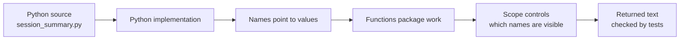

# Day 1 — Python Foundations

**Boot.dev chapters:** Introduction · Variables · Functions · Scope  
**Project connection:** `day-01-foundations` Learning Journal CLI

## Today’s map



**Day 1 goal:** make two small functions that receive values, create text, and
return it. The goal is not to memorize every Python detail—it is to clearly
track where a value comes from, where it is available, and where it goes next.

---

## 1. What happens when Python runs a script?

Python is often called an *interpreted* language. The useful beginner mental
model is not “Python reads one source line at a time.” In CPython (the usual
Python implementation), source code is first processed into an internal form
called **bytecode**, then the Python virtual machine executes that bytecode.

```text
You write               Python prepares                 Python runs
─────────               ───────────────                 ───────────
.py source       →     bytecode / code objects    →    actions + output

def greet(name):        instructions such as             print(...)
    return f"Hi {name}"  load a value, call, return       → Hi Ali
```

This is different from a traditional ahead-of-time compiled program, where a
compiler commonly produces machine code for a CPU before the program starts.
Both models translate code; the distinction is *when* and *what* they translate
into. “Python is interpreted” is a helpful shorthand, not a reason to assume
Python does no compilation.

> **Important:** bytecode is an implementation detail. Do not write code that
> depends on a particular bytecode instruction or its numbering.

Python’s `dis` documentation states that CPython bytecode is used by both its
compiler and interpreter, and warns that it can change between Python versions.
See [the official `dis` documentation](https://docs.python.org/3/library/dis.html).

### Optional 2-minute experiment

Run this in a terminal; it uses the standard library only:

```bash
python3 -c 'import dis; dis.dis("answer = 2 + 3")'
```

You will see implementation-specific instructions. You do **not** need to learn
them now. The experiment simply proves that Python has an intermediate execution
representation. Your output may differ by Python version.

---

## 2. Variables: names attached to values

A Python variable is better pictured as a labelled connection than as a rigid
box that permanently owns data.

```text
topic  ───────► "Variables"        (a string)
lessons_completed ─► 8             (an integer)
minutes_studied ───► 60            (an integer)
```

```python
topic = "Variables"
lessons_completed = 8
minutes_studied = 60
```

The `=` operator here means **bind the name on the left to the value on the
right**. It does not mean mathematical equality.

### Deeper layer: names, objects, and identity

Python values are objects, and names refer to those objects. Two different names
can refer to the same object.

```python
first_topic = "Variables"
current_topic = first_topic
```

```text
first_topic   ─┐
               ├──► "Variables"
current_topic ─┘
```

If you later reassign one name, you make a new connection; you do not alter the
other name’s connection:

```python
current_topic = "Functions"

# first_topic is still "Variables"
```

```text
first_topic   ───────► "Variables"
current_topic ───────► "Functions"
```

This mental model becomes especially important later with lists and dictionaries,
which can be changed in place. For today’s strings and integers, remember the
simple rule: **assignment gives a name a value; reassignment gives it a new
value.**

### Names that explain the value

```text
Hard to read             Easy to read
────────────             ────────────
x = 60                   minutes_studied = 60
n = "Variables"          topic = "Variables"
```

Prefer a descriptive name. Keep a name’s meaning stable: do not make
`minutes_studied` later hold a sentence. This makes code easier to test and
debug. [Real Python’s variable best-practices guide](https://realpython.com/ref/best-practices/variables/)
also recommends descriptive names, stable types, and limited global state.

### Equality versus assignment

```python
minutes_studied = 60   # assign / bind a name
minutes_studied == 60  # ask a question: is it equal to 60?
```

`==` is for a later control-flow lesson. Today, recognize the difference so it
does not become a confusing typo.

---

## 3. Functions: named, reusable steps

A function gathers one small piece of work behind a useful name. Its input is
written in the parentheses; its output is produced by `return`.

```mermaid
flowchart LR
    A[topic<br/>"Variables"] --> F[format_session]
    B[lessons<br/>8] --> F
    C[minutes<br/>60] --> F
    F --> D[one formatted string]
```

```python
def format_session(topic, lessons_completed, minutes_studied):
    return f"Topic: {topic} | Lessons: {lessons_completed} | Time: {minutes_studied} minutes"
```

| Term | Meaning in the example |
| --- | --- |
| `def` | Starts a function definition. It defines the recipe; it does not run it yet. |
| `format_session` | The function’s name. Use a verb phrase for an action. |
| Parameters | `topic`, `lessons_completed`, and `minutes_studied`: local input names in the recipe. |
| `return` | Sends a value back to the code that called the function. |
| f-string | A string prefixed with `f`; `{name}` is replaced with that value. |

### Parameter vs argument

```text
Definition (recipe)                         Call (using the recipe)
───────────────────                         ───────────────────────
def format_session(topic, ...):             format_session("Variables", 8, 60)
                   └─ parameter ─┘                         └ arguments ┘
```

Parameters are placeholder names in the function definition. Arguments are
actual values supplied during a call.

### `return` vs `print`

```text
return value                                print(value)
────────────                                ────────────
gives a result back to the caller           displays text to the terminal
can be stored, tested, or reused             mainly lets a human see something
```

```python
summary = format_session("Variables", 8, 60)  # receives returned text
print(summary)                               # displays it
```

For this project, formatting functions should return text. That lets the tests
compare the result exactly and lets a later CLI decide where to display it.

### Deeper layer: what a function call creates

When Python calls a function, it creates a separate **call frame**: a small work
area that holds that call’s parameters and local names. When the function returns,
that call frame is finished and its local names are no longer directly available.

```text
Before the call                 During format_session(...) call
───────────────                 ──────────────────────────────
module frame                    module frame
┌──────────────────┐            ┌──────────────────┐
│ topic = "Scope"  │            │ topic = "Scope"  │
└──────────────────┘            └──────────────────┘
                                       │ calls
                                       ▼
                                  function frame
                                  ┌───────────────────────────────┐
                                  │ topic = "Variables"           │
                                  │ lessons_completed = 8          │
                                  │ minutes_studied = 60           │
                                  └───────────────────────────────┘
                                       │ returns a string
                                       ▼
                                  function frame ends
```

Each call gets its own local names. This is why the same function can be called
with different arguments without the calls interfering with each other.

### A precise beginner-friendly rule for arguments

Python passes a **reference to an object** into a function. A function can use a
parameter name to refer to the same value as its caller. Reassigning the parameter
only changes that local name:

```python
def rename_topic(topic):
    topic = "Functions"
    return topic

original_topic = "Variables"
new_topic = rename_topic(original_topic)

# original_topic is "Variables"; new_topic is "Functions"
```

For Day 1, you do not need a formal name for this behavior. The safe habit is to
pass values in and return a result out. Later, lists and dictionaries will add an
important wrinkle because their contents can be modified.

---

## 4. Scope: where a name is available

**Scope** is the part of a program where a name can be used. A function call
creates a local scope for its parameters and local variables.

```python
learner_name = "Ali"  # global/module-level name

def build_heading(learner_name):
    heading = f"{learner_name}'s Learning Journal"  # local name
    return heading

result = build_heading("Sam")
```

```text
Module scope
┌────────────────────────────────────────────────────────────┐
│ learner_name → "Ali"                                       │
│ result       → "Sam's Learning Journal"                    │
│                                                            │
│  build_heading("Sam") creates a temporary local scope      │
│  ┌──────────────────────────────────────────────────────┐  │
│  │ learner_name → "Sam"                                 │  │
│  │ heading      → "Sam's Learning Journal"              │  │
│  └──────────────────────────────────────────────────────┘  │
│          local names disappear after the call returns        │
└────────────────────────────────────────────────────────────┘
```

The two names `learner_name` are in different scopes. The function parameter
temporarily **shadows** the module-level name; it does not change it.

### The simple rule for today

```text
Need a value inside a function?  → pass it as a parameter.
Need a result outside a function? → return it.
```

This habit reduces hidden dependencies and makes each function easy to test.
Python resolves names from nearby to farther-away scopes; the familiar mnemonic
is **LEGB**: Local → Enclosing → Global → Built-in. For Day 1, focus only on
local and module-level scope. The exact name-binding and lookup rules are in
[Python’s official execution-model reference](https://docs.python.org/3/reference/executionmodel.html).

### Shadowing: same spelling, different name binding

```python
topic = "Variables"

def show_topic():
    topic = "Functions"
    return topic

print(show_topic())  # Functions
print(topic)         # Variables
```

```text
Inside show_topic():               Outside show_topic():
local topic ─────► "Functions"    global topic ───► "Variables"
```

The local binding hides, or **shadows**, the global binding while the function is
running. Avoid this naming overlap in early programs: pass the value as a
parameter instead. It makes the data flow visible.

### Why assigning inside a function can surprise you

```python
score = 10

def increase_score():
    score = score + 1  # error
```

Because `score` is assigned in `increase_score`, Python treats `score` as a local
name for that whole function. The right side tries to use that local name before
it has a value, producing `UnboundLocalError`. Do not solve this with `global` in
today’s project. Make the dependency explicit instead:

```python
def increase_score(score):
    return score + 1

new_score = increase_score(10)
```

---

## 4.5 Errors happen at different moments

Learning to locate an error is a superpower. This preview is useful now; the
dedicated Errors and Testing chapters will teach the full toolkit later.

```text
Write source ──► parse/compile ──► run program
     │                 │                 │
     │                 │                 └─ Runtime error
     │                 └─ Syntax error
     └─ Logic error may run successfully but produce the wrong result
```

| Kind | Example | What it means |
| --- | --- | --- |
| Syntax error | `def greet(name)` without `:` | Python cannot understand the code’s grammar. |
| Runtime error | `print(unknown_name)` | The program started, then encountered an impossible request (`NameError`). |
| Logic error | returning `"Lessons: 60"` when 60 is minutes | The program ran, but its result is wrong. Tests are excellent at finding these. |

When an error appears, read the last line of the traceback first. Then find the
referenced file and line number. Change the smallest relevant part of your code
and run again.

---

## 5. Connect the idea to today’s test

```text
Test calls function
       │
       ▼
format_session("Variables", 8, 60)
       │
       ▼
Function uses local parameters + f-string
       │
       ▼
return "Topic: Variables | Lessons: 8 | Time: 60 minutes"
       │
       ▼
Test compares actual returned text with expected text
```

The test is an executable statement of the program’s required behavior. If it
fails with `None`, Python reached the end of your function without returning a
value. Add the appropriate `return` expression; do not modify the expected value
in the test.

---

## Quick self-check

1. What is the difference between `=` and `==`?
2. In `def greet(name):`, is `name` a parameter or an argument?
3. Why does `return` make `format_session` easier to test than `print`?
4. Can code outside a function use a variable first created inside it?
5. In one sentence, describe the path from a `.py` file to output in CPython.

## My reflection

Fill this in after the project tests pass:

```text
Most useful idea today:

One thing that confused me:

What I changed after reading a test failure:

Question to revisit tomorrow:
```

## Sources and further reading

- [Boot.dev — Learn Python for Beginners](https://www.boot.dev/courses/learn-python-beginners)
- [Python documentation — Execution model: naming, binding, and scope](https://docs.python.org/3/reference/executionmodel.html)
- [Python documentation — `dis`: inspecting CPython bytecode](https://docs.python.org/3/library/dis.html)
- [Real Python — Variables best practices](https://realpython.com/ref/best-practices/variables/)
- [Real Python — Scope and the LEGB rule](https://realpython.com/python-scope-legb-rule/)
