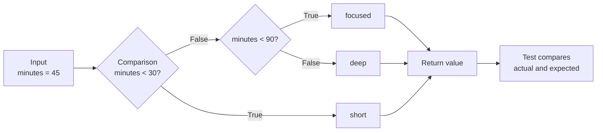

# Day 2 — Control Flow, Computing, Testing, and Debugging

**Project:** `day-02-control-flow`  
**Outcome:** decide which code runs, repeat a small action safely, and use tests
to verify the result.

## The big picture



**Control flow** means the order in which a program executes instructions.
Variables store state; comparisons ask questions about that state; conditionals
choose a branch; loops repeat work; tests verify the output.

---

## 1. Testing: a precise statement of expected behavior

A unit test checks one small unit of behavior:

```text
Arrange                 Act                         Assert
───────                 ───                         ──────
input: 30        →      classify_session(30)  →    result is "focused"
```

```python
self.assertEqual(classify_session(30), "focused")
```

Tests are not a substitute for thinking. They make expectations repeatable. A
passing test proves that its specific example works; multiple tests—especially at
boundaries—provide broader confidence.

### Boundary values

```text
short:   minutes < 30
focused: 30 <= minutes < 90
deep:    minutes >= 90

         29 | 30 ................ 89 | 90
          ↑    ↑                    ↑    ↑
        test the exact point where behavior changes
```

| Input | Expected label | Why it matters |
| ---: | --- | --- |
| 29 | `short` | last value before the first boundary |
| 30 | `focused` | first value in the next range |
| 89 | `focused` | final value before the next boundary |
| 90 | `deep` | first value in the final range |

### Reading failures

```text
AssertionError: 'short' != 'focused'
                 actual       expected
```

1. Read the test name: what behavior was requested?
2. Compare expected with actual.
3. Trace the condition that selected the wrong branch.
4. Change the source file, not the test.
5. Rerun the whole suite.

Run Day 2 tests from its directory:

```bash
python3 -m unittest discover -s tests -v
```

Read: [official `unittest` documentation](https://docs.python.org/3/library/unittest.html).  
Watch: [Corey Schafer — Unit Testing with `unittest`](https://www.youtube.com/watch?v=6tNS--WetLI).

---

## 2. Computing and algorithms

At a high level, a computer follows exact instructions. Python makes those
instructions readable, but it does not guess the rule you meant.

```text
state (values) + instructions + decisions + repetition → output
```

An **algorithm** is a finite, unambiguous sequence of steps that turns input into
output. `classify_session` is a tiny algorithm:

```text
receive minutes
 ├─ under 30?      return short
 ├─ otherwise <90? return focused
 └─ otherwise      return deep
```

Trace code exactly as Python does:

```python
minutes_studied = 45

if minutes_studied < 30:
    level = "short"
elif minutes_studied < 90:
    level = "focused"
else:
    level = "deep"
```

| Step | Evaluation | Result |
| --- | --- | --- |
| 1 | `45 < 30` | `False`; skip that block |
| 2 | `45 < 90` | `True`; run this block |
| 3 | assign `level` | `"focused"` |
| 4 | remaining `else` | skipped |

Only one branch of an `if` / `elif` / `else` chain runs.

---

## 3. Comparisons and Boolean values

A comparison evaluates to one of two Boolean values: `True` or `False`.

| Operator | Meaning | Example | Result |
| --- | --- | --- | --- |
| `==` | equal to | `30 == 30` | `True` |
| `!=` | not equal to | `30 != 90` | `True` |
| `<` | less than | `29 < 30` | `True` |
| `<=` | less than or equal | `30 <= 30` | `True` |
| `>` | greater than | `90 > 90` | `False` |
| `>=` | greater than or equal | `90 >= 90` | `True` |

```python
level = "focused"    # assignment: bind a name
level == "focused"   # comparison: ask a question
```

### Combining questions

```text
AND: both parts must be true        OR: at least one part is true
True  and False → False             True  or False → True
True  and True  → True              False or False → False
```

For this project, an ordered chain is clearer than writing both lower and upper
bounds repeatedly:

```python
if minutes_studied < 30:
    return "short"
elif minutes_studied < 90:  # reaching here already means 30 or more
    return "focused"
else:
    return "deep"
```

The order matters. Writing `< 90` first would capture 29 and make the `< 30`
branch unreachable.

Read: [Python control-flow tutorial](https://docs.python.org/3/tutorial/controlflow.html).  
Watch/read: [MIT OpenCourseWare — comparisons exercise](https://ocw.mit.edu/courses/6-0001-introduction-to-computer-science-and-programming-in-python-fall-2016/resources/comparisons-1/).

---

## 4. Loops: controlled repetition

Use a loop instead of copy-pasting the same action. The progress bar needs one
marker per position.

```text
goal = 5
range(5) produces: 0, 1, 2, 3, 4
                   └───────────── five values; stop value excluded
```

```python
bar = "["

for position in range(goal):
    if position < completed:
        bar = bar + "#"
    else:
        bar = bar + "-"

return bar + "]"
```

### Trace `build_progress_bar(3, 5)`

| `position` | Is it `< 3`? | Add | `bar` |
| ---: | --- | --- | --- |
| start | — | — | `[` |
| 0 | True | `#` | `[#` |
| 1 | True | `#` | `[##` |
| 2 | True | `#` | `[###` |
| 3 | False | `-` | `[###-` |
| 4 | False | `-` | `[###--` |
| after loop | — | `]` | `[###--]` |

### `for` and `while`

```text
for   → repeat over a known sequence or known number of times.
while → repeat while a condition remains true; code must make it become false.
```

```python
# Exactly three repetitions
for position in range(3):
    print(position)

# Same result, but easier to accidentally make infinite
position = 0
while position < 3:
    print(position)
    position = position + 1
```

For this task, `for position in range(goal)` is best because it states exactly
how many markers are needed and guarantees the loop finishes for a valid goal.

---

## 5. Debugging control flow

```text
Reproduce → read error/test output → form a hypothesis → inspect values
        → smallest fix → rerun all tests → remove debug output
```

For loop bugs, show the changing values temporarily:

```python
print(position, bar)  # remove after understanding the bug
```

Or pause with Python’s built-in debugger:

```python
breakpoint()
```

At the `(Pdb)` prompt, `p position` prints the variable and `continue` resumes.
Read: [official `pdb` documentation](https://docs.python.org/3/library/pdb.html).

## Common mistakes

| Mistake | Why it is wrong | Better approach |
| --- | --- | --- |
| Test `minutes < 90` before `< 30` | 29 enters the wrong branch. | Put narrower earlier ranges first. |
| Use `range(1, goal)` | Makes one fewer marker. | `range(goal)` provides exactly `goal` positions. |
| Forget to update a `while` counter | Condition never changes; loop can be infinite. | Use `for range()` when count is known. |
| Print instead of return | Result cannot be conveniently reused by the report/test. | Return the constructed value. |
| Modify the test expectation | Hides the incorrect implementation. | Fix source logic. |

## Practice and reflection

1. Predict `list(range(4))`.
2. What labels belong to 29, 30, 89, and 90?
3. Trace `build_progress_bar(1, 3)` on paper.
4. Why does the `elif minutes_studied < 90` branch include 30?

```text
One boundary I understand:

One loop trace I can explain:

The first failure I saw and what it taught me:

Question for review:
```
