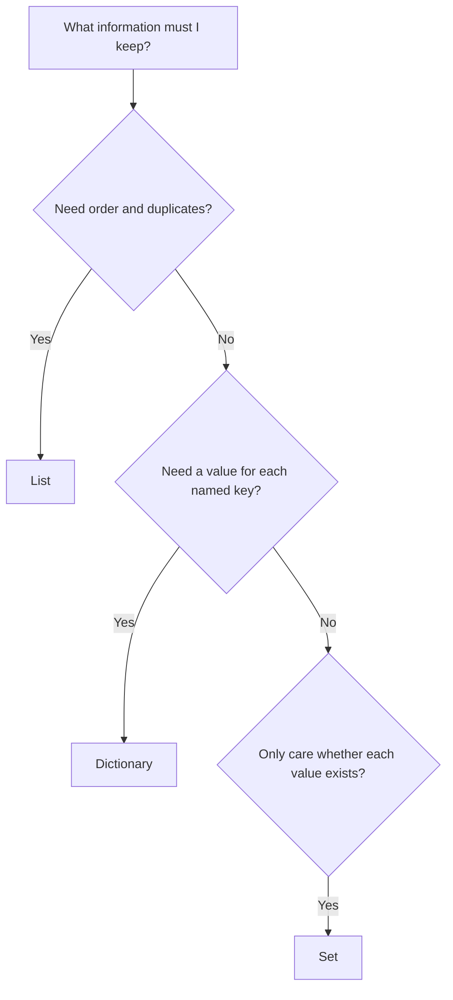
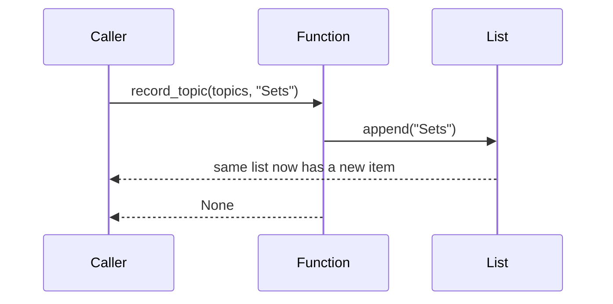

# Day 3 — Lists, Dictionaries, and Sets

**Project:** `day-03-collections`  
**Outcome:** choose a collection by the question you need to answer, not by habit.

## The collection-selection map



| Collection | Picture it as | Keeps order? | Keeps duplicates? | Main question answered |
| --- | --- | --- | --- | --- |
| `list` | numbered notebook pages | Yes | Yes | “What happened, and in what order?” |
| `dict` | labelled lookup table | insertion order | keys: no | “What value belongs to this key?” |
| `set` | bag of unique labels | no meaningful index | No | “Has this value appeared?” |

Today’s journal uses all three views of the same information:

```text
Topics recorded: ["Variables", "Loops", "Variables", "Lists"]
                 └──────────────────────────────────────────┘
                 list: preserve every study session

Counts:          {"Variables": 2, "Loops": 1, "Lists": 1}
                 └──────────────────────────────────────────┘
                 dictionary: lookup each topic's count

Unique topics:   {"Variables", "Loops", "Lists"}
                 └──────────────────────────────────────────┘
                 set: one copy of each topic
```

---

## 1. Lists: ordered, changeable sequences

Use a list when position and repetition matter.

```python
topics = ["Variables", "Functions", "Variables"]
```

```text
index:      0             1              2
         ┌───────────┬─────────────┬───────────┐
topics = │ Variables │ Functions   │ Variables │
         └───────────┴─────────────┴───────────┘
```

Lists are **mutable**: their contents can change after creation.

```python
topics.append("Scope")
# topics is now ["Variables", "Functions", "Variables", "Scope"]
```

`append()` changes the existing list and returns `None`. This prevents a common
mistake:

```python
# Wrong: append does not create and return a replacement list.
topics = topics.append("Scope")

# Correct
topics.append("Scope")
```

### Indexing and length

```python
topics[0]      # "Variables": first item
topics[-1]     # "Variables": last item
len(topics)    # 3: number of items
```

Indexing begins at zero because an index describes an offset from the start:

```text
start → offset 0 → offset 1 → offset 2
```

### Mutation versus return values



`record_topic` receives a reference to the caller’s list. Calling `append` on it
changes that one list, so the caller can see the new topic. This is intentional
for the task. In contrast, `count_topics` and `get_unique_topics` should create
and return new collections, leaving the original list untouched.

---

## 2. Dictionaries: keys mapped to values

Use a dictionary when every value has a meaningful label, called a **key**.

```python
topic_counts = {
    "Variables": 2,
    "Loops": 1,
}
```

```text
key             value
──────────      ─────
"Variables" ─►   2
"Loops"     ─►   1
```

Keys must be unique. Assigning an existing key replaces its old value:

```python
topic_counts["Loops"] = 2
```

### Counting pattern

To count each topic, loop through the list. If the topic has appeared before,
increase the existing count. Otherwise, begin its count at one.

```python
counts = {}

for topic in topics:
    if topic in counts:
        counts[topic] = counts[topic] + 1
    else:
        counts[topic] = 1
```

Trace for `["Variables", "Loops", "Variables"]`:

| Current `topic` | Is it already a key? | New `counts` |
| --- | --- | --- |
| `Variables` | No | `{"Variables": 1}` |
| `Loops` | No | `{"Variables": 1, "Loops": 1}` |
| `Variables` | Yes | `{"Variables": 2, "Loops": 1}` |

`topic in counts` checks dictionary **keys**, not values. This is exactly what
the counting algorithm needs.

### Lookup safely later

```python
count = topic_counts["Loops"]      # 1; missing key raises KeyError
count = topic_counts.get("Sets", 0)  # 0; fallback if absent
```

The project’s counting algorithm uses `if topic in counts` because it makes the
first-seen and repeated-topic cases explicit. `dict.get()` is another useful
pattern you will meet again.

---

## 3. Sets: unique membership

A set stores each value once. It is ideal when duplicates carry no additional
meaning.

```python
topics = ["Lists", "Sets", "Lists", "Dictionaries"]
unique_topics = set(topics)

# {"Lists", "Sets", "Dictionaries"}; display order is not guaranteed
```

```text
list input:      Lists ── Sets ── Lists ── Dictionaries
                                      │
                                      ▼ duplicate discarded
set result:      {Lists, Sets, Dictionaries}
```

### Important set rules

- A set does not store duplicate values.
- Sets are not indexed: `unique_topics[0]` is an error.
- Do not rely on the display/iteration order of a set.
- Use `set()` for an empty set. `{}` creates an empty dictionary.

```python
empty_set = set()
empty_dictionary = {}
```

### Membership is the strength of a set

```python
"Loops" in unique_topics  # True or False
```

This reads like English and directly expresses the question: “Was Loops studied
at least once?” Later you will also use set operations for intersections,
differences, and deduplicating data.

---

## 4. Build the Day 3 project from the data flow

```text
topics list
    │
    ├── record_topic(...) ──► mutates the same list
    │
    ├── count_topics(...) ──► new dictionary of counts
    │
    └── get_unique_topics(...) ──► new set of distinct names
                                        │
                                        ▼
                             build_topic_report(...)
                             uses len(list) and len(set)
```

The report should not need to understand *how* duplicates are removed. It calls
`get_unique_topics`, then works with its returned result. This is modular design:
each function has one focused job.

```python
def build_topic_report(topics: list[str]) -> str:
    unique_topics = get_unique_topics(topics)
    return f"Study sessions: {len(topics)} | Unique topics: {len(unique_topics)}"
```

The type annotations are a contract for humans and tools:

```text
list[str]       → list whose items are strings
dict[str, int]  → dictionary from string keys to integer values
set[str]        → set whose items are strings
None            → function returns no useful value (it performs a side effect)
```

They do not validate at runtime. Keep them accurate and let tests describe the
required behavior.

---

## 5. Common mistakes

| Mistake | Why it fails | Better approach |
| --- | --- | --- |
| `topics = topics.append("Sets")` | `append()` returns `None`. | Call `topics.append("Sets")` on its own. |
| Use `{}` for an empty set | `{}` is an empty dictionary. | Use `set()`. |
| Expect a set to preserve position | A set has no indices or promised display order. | Use a list when order matters. |
| Assume duplicate dict keys coexist | A key maps to one value only. | Update the existing value when counting. |
| Modify `topics` in `count_topics` | Counting should not destroy session history. | Create a new `counts` dictionary. |
| Write `topic in counts.values()` | You need to find a topic name, which is a key. | Write `topic in counts`. |

## Practice before coding

1. What is `len(["A", "B", "A"])`? What is `len(set(["A", "B", "A"]))`?
2. Explain why a list, rather than a set, stores the journal’s session history.
3. Trace the counting algorithm for `["Loops", "Loops", "Sets"]`.
4. Why does `record_topic` return `None`, while `count_topics` returns a dict?
5. Create an empty list, dict, and set from memory.

## Reflection

```text
A situation where I would choose a list:

A situation where I would choose a dictionary:

A situation where I would choose a set:

One mutation behavior I can now explain:

Question for review:
```

## Free resources

- [Python Tutorial — Data Structures](https://docs.python.org/3/tutorial/datastructures.html)
- [Python documentation — built-in `list`, `dict`, and `set` types](https://docs.python.org/3/library/stdtypes.html)
- [Corey Schafer — Lists, tuples, and sets (YouTube)](https://www.youtube.com/watch?v=W8KRzm-HUcc)
